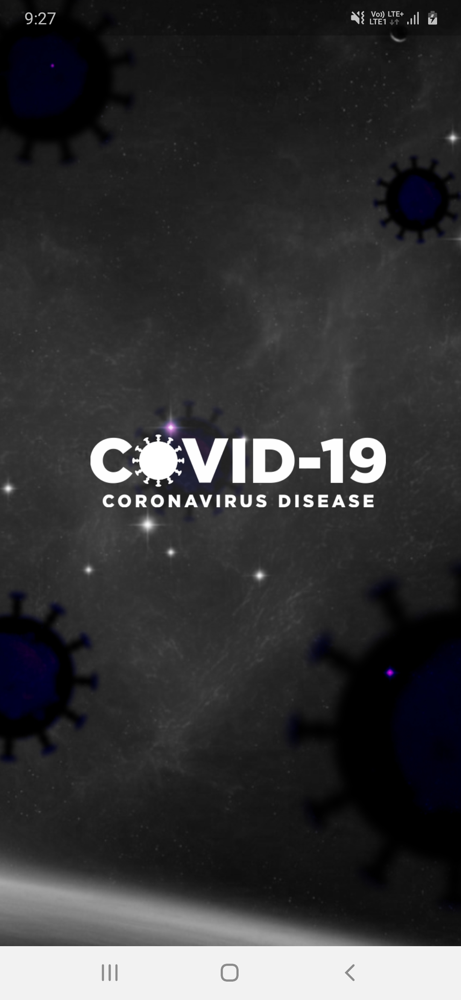
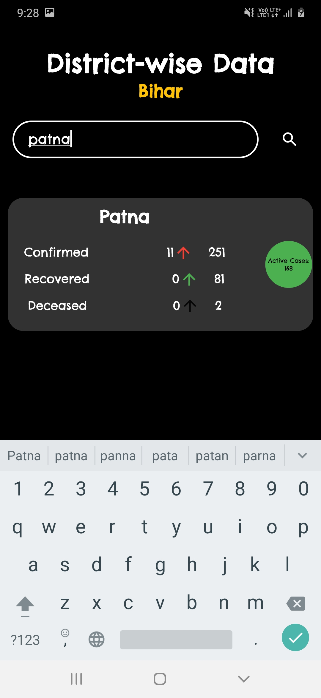
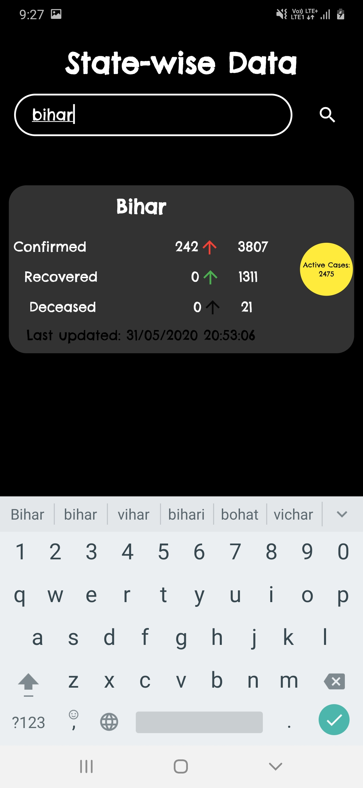
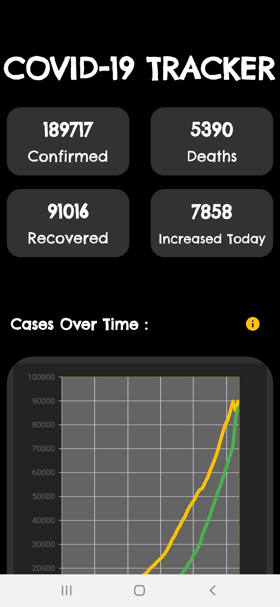
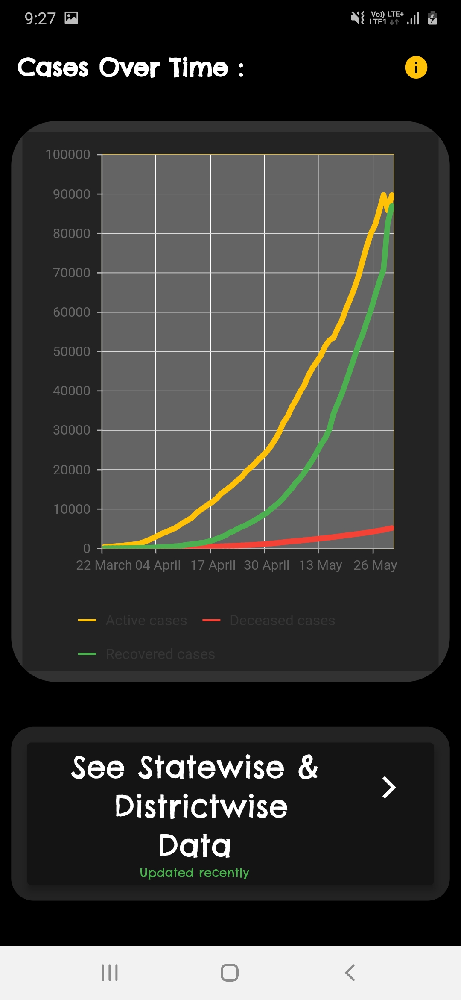
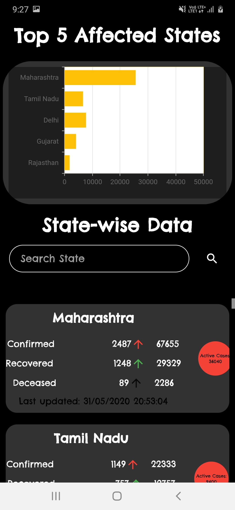
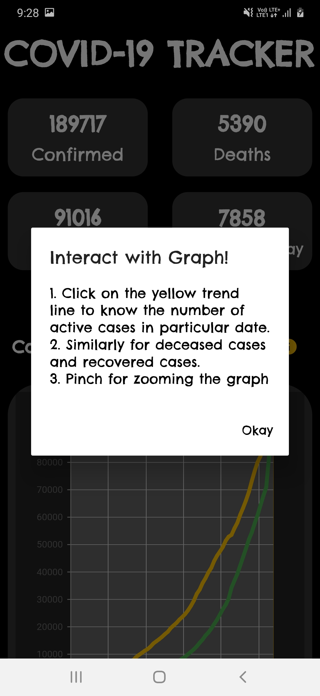

# COVID-19 Tracker

Its a flutter app which shows you covid19 data like confirmed cases, recovered cases, deaths in an amazing and easy user friendly way.
This app focuses on analytics and hence uses synfusion charts to show you time series trend of covid in India.
It contains statewise and districtwise data.
No network! Dont worry , It can show you old loaded Data.

## See the sample images below-

